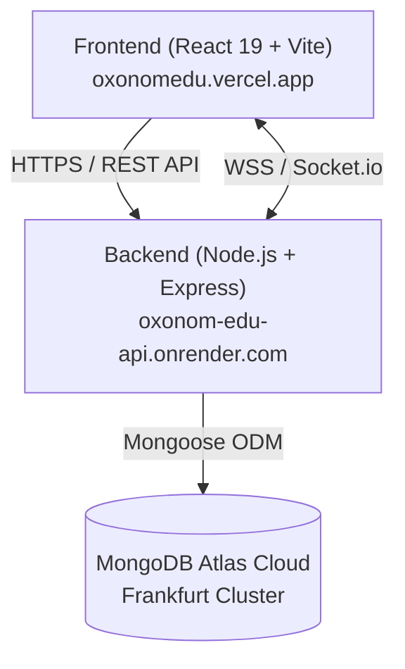

# 🌟 Oxonom Edu - Kapsamlı Sistem & Özellikler Rehberi

**Oxonom Edu**, modern okullar, öğretmenler ve öğrenciler için geliştirilmiş; **Akıllı İnteraktif Tahta**, **Modül Ekosistemi (Eklentiler)** ve **Bütünleşik Okul Yönetim Sistemini (Sınıf, Yoklama, Ödev, Sınav, Veli İletişimi)** tek bir çatıda birleştiren yeni nesil bir eğitim teknolojileri (EdTech) platformudur.

---

## 📌 İçindekiler
1. [Sistemin Amacı ve Temel Vizyonu](#1-sistemin-amacı-ve-temel-vizyonu)
2. [🎨 Akıllı İnteraktif Tahta (Smart Whiteboard)](#2--akıllı-interaktif-tahta-smart-whiteboard)
3. [🧩 Modül Ekosistemi (Add-on Platformu)](#3--modül-ekosistemi-add-on-platformu)
4. [👩‍🏫 Öğretmen Modülü ve Yönetim Paneli](#4--öğretmen-modülü-ve-yönetim-paneli)
5. [🎓 Öğrenci ve Veli Paneli](#5--öğrenci-ve-veli-paneli)
6. [🛡️ Süperadmin (Sistem Yönetimi) Paneli](#6-️-süperadmin-sistem-yönetimi-paneli)
7. [🔒 Güvenlik, KVKK ve Teknik Mimari](#7--güvenlik-kvkk-ve-teknik-mimari)

---

## 1. Sistemin Amacı ve Temel Vizyonu

Oxonom Edu; akıllı tahta yazılımları, okul yönetim bilgi sistemleri ve sınıf içi interaktif eğitim araçları arasındaki kopukluğu ortadan kaldırmak üzere tasarlanmıştır.

- **Tek Noktadan Yönetim:** Öğretmen tahtada ders anlatırken tek tıkla yoklama alabilir, derse özel ödev atayabilir, MEB yazı tipleriyle ilkokul okuma-yazma çalışmaları yaptırabilir veya gerçek zamanlı tahtasını öğrencilerin cihazlarına yansıtabilir.
- **Eklenti (Modül) Odaklı Mimari:** Sisteme yeni bir pedagojik araç (örn. Hızlı Okuma, Matematik Çarkı, Periyodik Tablo vb.) eklendiğinde tüm sisteme yayılır; öğretmenler bunu istedikleri sınıfta tek tıkla aktif edebilir.
- **Dokunmatik & PWA Uyumluluğu:** Vestel, Arçelik, Promethean, SMART Board gibi tüm MEB akıllı tahtalarında, tabletlerde ve telefonlarda uygulama gibi kurulabilir (PWA).

---

## 2. 🎨 Akıllı İnteraktif Tahta (Smart Whiteboard)

Oxonom Edu'nun kalbini oluşturan akıllı tahta motoru, geleneksel tahtaların ötesinde öğretmen ve öğrencilere zengin bir çalışma ortamı sunar:

### A. Çizim ve Tasarım Araçları
- **Kalem & Fırça (Brush & Pencil):** 
  - Dinamik boyut kaydırıcısı (slider büyüdükçe gösterge noktası büyür, hassas kalınlık ayarı sağlar).
  - Geniş renk paleti ve özel RGB/HEX renk seçici.
- **Şekil Çizim Motoru:** Düz çizgi, çift yönlü ok, dikdörtgen, kare, elips, daire ve serbest çizim.
- **Silgi:** Hassas piksel silgisi ve tek dokunuşla nesne silme modu.
- **Lazer İşaretçi (Laser Pointer):** Ders anlatımı sırasında dikkat çekilen noktanın arkasında sönen ışıklı iz bırakır.
- **Seçim & Taşıma (Selection Tool):** Çizilen nesneleri serbestçe taşıma, boyutlandırma ve döndürme.

### B. MEB Uyumlu Tipografi & Metin Kutuları
- **MEB TTKB Dik Temel Abece Desteği:** İlkokul 1. ve 2. sınıf müfredatına %100 uyumlu orijinal Talim Terbiye Kurulu standart dik temel harf yazı tipi.
- **Kılavuz Çizgili Yazı Modu:** 4 çizgili 3 aralıklı resmi defter standardı font desteği. Öğretmen tahtaya yazdığı anda harfler defter çizgileriyle birebir oturur.

### C. Zengin Emoji & Tabela Kütüphanesi (7 Kategori - 150+ Simge)
Ders anlatımını ve yönergeleri görselleştirmek amacıyla doğrudan tahtaya yüksek çözünürlüklü vektörel simgeler eklenebilir:
1. **İşaret & Tabela & Yön:** Soru işareti, ünlem, onay, çarpı, dur tabelası, yön okları (`➡️`, `⬅️`, `⬆️`, `🛑`, `⚠️`, `✅`, `❌`).
2. **Eğitim & Okul & Dersler:** Kitap, defter, kalem, cetvel, pergel, çanta (`📚`, `📖`, `✏️`, `📝`, `📐`, `📏`, `🎒`).
3. **Matematik & Mantık:** Dört işlem, abaküs, eşitlik, geometri (`🧮`, `➕`, `➖`, `✖️`, `➗`, `🟰`).
4. **Fen & Laboratuvar & Teknoloji:** Mikroskop, deney tüpü, DNA, teleskop, gezegen, bilgisayar (`🔬`, `🧪`, `🧬`, `🔭`, `🌍`, `💻`).
5. **Öğretmen & Ödül & Rozet:** Kupa, madalya, yıldız, tebrik, yüz puan (`🏆`, `🥇`, `⭐`, `🌟`, `💯`, `🎉`).
6. **Sınıf Katılımı & Mimikler:** Parmak kaldıran öğrenci, düşünen yüz, sessizlik işareti (`🙋‍♂️`, `🙋‍♀️`, `🤔`, `🤫`).
7. **Popüler Günlük:** Sık kullanılan duygusal ifadeler ve tepki simgeleri.

### D. Katmanlar (Layers) & Tuval Yönetimi
- **Katman Paneli:** Çizimleri katmanlara ayırma, görünürlüğü açıp kapama, kilitleme ve katman sırasını değiştirme.
- **Gelişmiş Geri Al / Yinele (Undo / Redo):** "Tuvali Temizle" eylemi dahil olmak üzere tahtadaki tüm adımlar geçmişte saklanır. Tuval yanlışlıkla temizlense dahi Ctrl+Z (veya Geri Al butonu) ile tüm içerik anında kurtarılır.
- **Modern Odakla Butonu:** Çizimleri tek tıkla ekrana en uygun açıyla sığdıran akıllı odaklama mekanizması.

### E. Canlı İşbirliği & QR Kod Entegrasyonu
- **Socket.io Gerçek Zamanlı Senkronizasyon:** Öğretmenin tahtada çizdiği her çizgi, sınıftaki öğrencilerin veya uzaktaki katılımcıların ekranına sıfır gecikmeyle yansır.
- **Oda QR Kodu:** Tahtanın sağ üstündeki QR koda cep telefonu veya tabletle okutan öğrenci doğrudan o tahtaya izleyici veya katılımcı olarak bağlanabilir.
- **Dışa Aktarma (Export):** Tahta içeriği tek tıkla yüksek çözünürlüklü PNG görseli veya çok sayfalı PDF dokümanı olarak indirilebilir.

---

## 3. 🧩 Modül Ekosistemi (Add-on Platformu)

Oxonom Edu, standart bir tahta olmanın ötesinde genişletilebilir bir modül mimarisine sahiptir:

| Özellik | Açıklama |
| :--- | :--- |
| **Dinamik Modül Entegrasyonu** | Admin panelinden yüklenen yeni modüller anında tüm sistemde ve öğretmen panellerinde listelenir. |
| **Sınıf Düzeyinde Yetkilendirme** | Modüller her sınıfta görünmek zorunda değildir. Örneğin 1. sınıf modülü 8. sınıf tahtasında görünmez, karmaşa engellenir. |
| **Zengin Medya Desteği** | 16:9 otomatik kırpılmış çoklu görseller, YouTube tanıtım ve eğitim videoları, ayrıntılı pedagojik açıklamalar. |

### Örnek Modül: "1 Dk Okuma & Hızlı Okuma Atölyesi"
- **60 Saniyelik Akıllı Sayaç:** Öğrenci tahtadan metni okurken öğretmen tek dokunuşla hata yapılan kelimeleri işaretler.
- **MEB TTKB Harf Grupları:** Ses gruplarına (e-l-a-k-i-n, o-m-u-t-ü-y vb.) göre ayrılmış hece ve kelime piramitleri.
- **Anlık Başarı Karnesi:** Süre bittiğinde okunan toplam kelime, hatalı kelime ve dakikada okunan net kelime sayısı (WPM) anında ekrana yansıtılır.
- **Sınıf Eşleşmesi:** Otomatik olarak yalnızca 1. ve 2. sınıf düzeyindeki tahtalarda aktifleşir.

---

## 4. 👩‍🏫 Öğretmen Modülü ve Yönetim Paneli

Öğretmenler için hazırlanan yönetim paneli, günlük eğitim operasyonlarını hızlandıran modern araçlar sunar:

### A. Sınıf & Şube Yönetimi
- Sınıf oluşturma (Kademeler: 1'den 8'e kadar, Şubeler: A, B, C...).
- Sınıfa özel tema rengi belirleme (mavi, zümrüt yeşili, mor, kehribar vb.).
- Akademik yıl ve sınıf mevcudu takibi.

### B. Öğrenci Yönetimi & KVKK Korumalı Kayıt
- Öğrenci ekleme, düzenleme ve profil kartı.
- **KVKK Uyumlu TCKN Sistemi:** TC Kimlik Numaraları veritabanında AES-256 ile şifrelenir, arayüzde `123*****89` şeklinde maskelenir. Arama yapılabilmesi için tek yönlü SHA-256 hash mekanizması kullanılır.
- 1. ve 2. veli iletişim bilgileri, acil durum telefonları, öğrenciye özel pedagojik notlar.
- Tek tıkla Excel/CSV formatında öğrenci listesi içe/dışa aktarma.

### C. Akıllı Yoklama Sistemi
- **Ders Bazlı Oturumlar:** Tarih, ders saati ve konuya göre yoklama oturumu başlatma.
- **Hızlı Durum Seçimi:** Tek dokunuşla `Var (Geldi)`, `Yok (Gelmedi)`, `İzinli` veya `Geç Kaldı` işaretleme.
- **Yoklama Özeti & İstatistik:** Sınıfın katılım yüzdesi, devamsızlık sınırına yaklaşan öğrencilerin renkli uyarıları.

### D. Ödev Yönetimi & Teslim Takibi
- Başlık, ders adı, ayrıntılı açıklama ve son teslim tarihi belirleme.
- Öğrenci bazında teslim durumu (`Teslim Edildi`, `Gecikti`, `Teslim Edilmedi`).
- Ödev puanlama (100 üzerinden) ve öğretmenin öğrenciye özel geri bildirim notu.

### E. Sınav & Değerlendirme Sistemi
- Yazılı sınavlar, deneme sınavları, quizler ve performans ödevleri tanımlama.
- Sınıf başarı ortalaması, en yüksek/en düşük not grafiği.
- Öğrencilerin geçmiş sınav karnesi ve gelişim eğrisi.

### F. Veli-Öğretmen Görüşme (Randevu) Talepleri
- Velilerden gelen yüz yüze veya çevrimiçi görüşme taleplerini listeleme.
- Talepleri onaylama, reddetme veya alternatif tarih önerme.
- Görüşme öncesi veli ile sistem içi güvenli mesajlaşma.

### G. Duyuru Ekosistemi
- Okul geneli veya sadece belirli sınıflara özel hedefli duyurular yayınlama.
- Önem derecesine göre rozetler (`Acil`, `Önemli`, `Bilgilendirme`).
- Bildirim sesi ve çan ikonu üzerinden anlık bildirim alma.

### H. Profilde Sınıf Modül Yetkileri (`/profile`)
- Öğretmen kendi profilinde sahip olduğu sınıfları hap (pill) butonlar halinde görür.
- Dilediği modülü (örn. 1 Dk Okuma) istediği sınıfta tek tıkla açıp kapatabilir.

---

## 5. 🎓 Öğrenci ve Veli Paneli

Öğrenciler ve veliler için sade, anlaşılır ve motive edici bir deneyim sunulmuştur:

- **Canlı & Kayıtlı Tahtalara Erişim:** Öğretmenin o sınıfta kaydettiği veya canlı yayında olduğu akıllı tahtaları kendi ekranından izleyebilme.
- **Ödev Takip Merkezi:** Teslim tarihi yaklaşan ödevleri görme, durumu kontrol etme ve öğretmenin verdiği puan/notu inceleme.
- **Sınav Sonuçları:** Katıldığı tüm sınavların notları, sınıf ortalaması ve kendi başarı grafiği.
- **Devamsızlık Durumu:** Kaç gün geldiği, kaç gün izinli veya devamsız olduğu bilgisi.
- **Veli Randevu Talebi Oluşturma:** Velinin öğretmenle görüşmek istediği konu ve uygun zamanı seçerek doğrudan randevu oluşturabilmesi.
- **Sınıf Duyuruları:** Öğretmenin paylaştığı etkinlik, gezi, ödev ve sınav duyurularını anlık takip edebilme.

---

## 6. 🛡️ Süperadmin (Sistem Yönetimi) Paneli

Platform yöneticilerinin sistemi uçtan uca kontrol ettiği ana kumanda merkezidir:

### A. Öğretmen Başvuru & Doğrulama Sistemi
- Yeni kayıt olan öğretmenlerin MEB/Okul kurum kodları ve belgelerinin doğrulanması.
- Başvuruları onaylama (`approved`), bekletme (`pending`) veya reddetme (`rejected`).
- Onay bekleyen öğretmenler için anlık KPI sayaçları.

### B. Modül Yönetim Merkezi (CRUD)
- Yeni eklenti modülleri sisteme ekleme, düzenleme veya yayından kaldırma.
- **Sürükle-Bırak 16:9 Görsel Yükleyici:** Yüklenen görselleri otomatik olarak 16:9 en-boy oranına kırpan akıllı araç.
- **YouTube Video Entegrasyonu:** Normal YouTube linki veya `<iframe>` embed kodu girildiğinde otomatik normalize edilen video oynatıcısı.
- Modülün hedef sınıf kademelerini (1, 2, 3...) seçme ve sıralamasını belirleme.

### C. Demo Modu & Otomatik Sıfırlama Yönetimi
- **30 Dakikalık Otomatik Sıfırlama:** Demo hesaplarda yapılan deneme değişikliklerinin sistemi kirletmemesi için her 30 dakikada bir verileri varsayılana döndüren otomatik motor.
- **Yönetici Kontrolü:** Süperadmin yeni bir modül eklerken veya ayar yaparken otomatik sıfırlamayı tek tıkla durdurabilir; işi bittiğinde tekrar açtığında sistem **en güncel haliyle** sıfırlanır.
- **Mobil Uyumlu Bildirim Çubuğu:** Sistemin demo modunda olduğunu zarifçe gösteren ve mobilde taşmayan uyarı bandı.

---

## 7. 🔒 Güvenlik, KVKK ve Teknik Mimari

Platform kurumsal eğitim standartlarına uygun modern bir teknoloji yığını ile inşa edilmiştir:

### Teknoloji Bileşenleri
- **Frontend:** React 19, Vite, Tailwind CSS, Framer Motion, Lucide Icons, Socket.io Client.
- **Backend:** Node.js, Express, Socket.io (WebSocket), Multer, Bcrypt, JWT.
- **Veritabanı:** MongoDB Atlas Cloud (Frankfurt AWS Veri Merkezi).
- **Barındırma & CI/CD:** 
  - Ön Yüz: **Vercel** (`https://oxonomedu.vercel.app`) - GitHub `main` dalına otomatik bağlı.
  - Arka Yüz: **Render** (`https://oxonom-edu-api.onrender.com`) - Sürekli çalışan WebSocket destekli sunucu.

### Güvenlik Standartları
- **TCKN Kriptografi:** TC Kimlik Numaraları veritabanında asla düz metin (plain-text) olarak saklanmaz. AES-256-CBC ile şifrelenir.
- **JWT Yetkilendirme:** Rol tabanlı erişim kontrolü (RBAC: Superadmin, Öğretmen, Öğrenci, Veli).
- **CORS & Rate Limiting:** Kötü niyetli istekleri ve brute-force saldırılarını engelleyen hız sınırlayıcılar.

---

*© 2026 Oxonom Edu. Tüm hakları saklıdır.*
